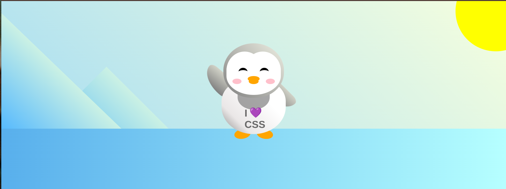

# 🐧 CSS Penguin Animation

A fun and interactive animated penguin built entirely with **HTML and CSS** — no JavaScript! This project features smooth transitions, playful animations, and a colorful cartoon landscape including mountains, a sun, and a waving penguin.

---

## 📸 Preview


---

## 🎨 Features

- ❄️ Pure CSS Penguin Illustration
- 🏔️ Custom CSS Mountains and Sky
- ☀️ Animated Background Elements
- 👋 Penguin waves using `@keyframes`
- 🐧 Penguin grows on click (`:active` transform)
- 💬 Cute shirt message: *"I CSS 💜"*
- 💡 Built entirely with HTML & CSS – no images or JS

---

## 🧱 Built With

- HTML5  
- CSS3 (Custom properties, keyframes, pseudo-elements)

---

## 📁 Project Structure

penguin-animation/
├── index.html # HTML structure
├── styles.css # All styling & animation
└── README.md # Project description

---

## 🚀 Getting Started

1. **Clone the repo**  
```bash
git clone https://github.com/your-username/css-penguin.git
Open in browser
Just double-click index.html or open it with Live Server in VS Code.

🔧 Customization
🎨 Change colors in the :root section of styles.css

🧢 Add accessories or new animations to the penguin

🌄 Try animating the sun or creating a snow effect

📱 Responsive?
This project is intended for desktop or tablet viewing due to absolute positioning. You can enhance it further with media queries.

👨‍💻 Author
Omar Elsayed
GitHub: @Oelsayed99

📜 License
This project is free to use under the MIT License.

❤️ Inspiration
Built as part of a fun CSS art challenge and inspired by FreeCodeCamp’s Responsive Web Design Curriculum.


